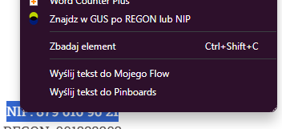
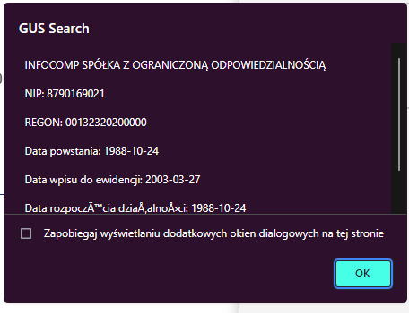

# GUS Search Addon

Addon that helps quick information search using active selection. You can select NIP or REGON numbers eg: 
- `NIP: 123 123 12 12`
- `REGON: 001323202`

Selected text MUST CONTAIN `NIP` or `REGON` string! After that you `RIGHT-CLICK` and pick `Znajdz w GUS po REGON lub NIP` to search.

# Local testing and development

You can debug this addon using Node.js and Visual Studio Code using debugging functionality.

If you want to test this extension in browser then:
1. Go to browser extensions
2. If you cannot see "Load unpacked extension" - look for information how to enable it (or enable some kind of in browser developer mode)
3. Click "Load unpacked"
4. Navigate to repository
5. Test :)